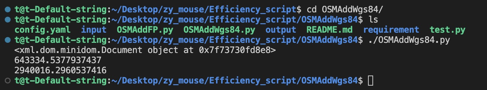

#### 绘制的lanelet2地图，把里面的坐标计算出对于的经纬度，并填写到<node id="134" lat="" lon=""> 经纬度标签里
## 1.0 依赖
```
pip3 install pyproj
```
## 2.0 使用方法
```
    git clone -b 2.0.0 https://github.com/zymouse/Efficiency_script.git
    cd OSMAddWgs84/
    chmod +x OSMAddWgs84.py
```
 - 在`input`文件夹下创建一个文件夹`jzy_map`
 - 把osm文件和origin.yaml文件放入`jzy_map`文件夹
 - 修改配置文件[如下图]

 - ./OSMAddWgs84.py  
 - `output`文件夹里是输出的OSM文件

## 3.0 成功验证

